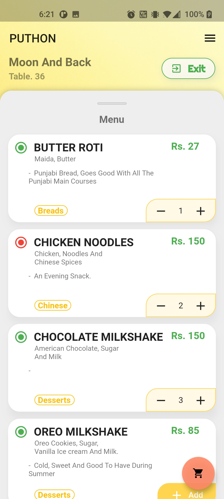

# HotelHost 

  HotelHost is a system of App and a Line following Robot working together to automate a restaurant's day to day processes.

## Puthon App

  Puthon ([view in Playstore](https://play.google.com/store/apps/details?id=com.lairofdevs.puthon)) app is used to order food, pay bill, view menu etc using QR codes and a Line following robot is used to deliver the food to respective table. The app is used by all the three users, namely Customers, Cooks and Admin. 
  
#### Customer Flow:
  1. Customers walk into store, and choose a table.
  2. Customers open the Puthon app and scan the QR code on the table to get menu.
  3. Customers select and add items to cart with quantity for each item.
  4. Customers go to cart and click on 'Place Order'.
  5. Customers wait for the order to get delivered through Bot. (Customers can place another order while their previous order is cooking)
  6. Bot reaches the Customers table. Step 3-6 are repeated if there are multiple orders.
  7. Customer can click on 'Pay' button, which will go to payment screen with generated bill.
  8. The payment screen has options with multiple payment apps like Google Pay, PhonePe, Paytm etc.
  9. Customer chooses an app and makes payment.
  10. Payment is confirmed by the app and generated bill is added to Customers's order history.

  
   
  
  
  

#### Cook Flow:
  1. Cook opens the app and goes into 'Cook Mode' (which is only visible to cook and admin)
  2. The Cook screen has list of orders in Ascending order based on time of the order.
  3. The cook can select any one of the order by clicking on 'Accept' and selects a duration for cooking.
  4. Once it is done, the cook places the order on the bot and scans the Bot's QR code.
  5. The screen goes back to list of orders and cook can select other orders to prepare.

  
   
   

#### Admin Features:
  - The app also has an 'Admin Mode' for resturant management.
  - Admin can Add or Remove Cooks.
  - Admin can Add, Edit or Remove a menu item.
  - Admin can also Enable or Disable an item on the menu temporarily.
  - Admin can view orders from all the tables in 'Tables' dashboard.
  - Admin can generate QR codes for Bot and Table.
    

  
  
   
  
  
  
  
  
  

## The Bot

  The Line following Robot implemented here is tweaked to find path to a particular table. The bot is designed to find path on the pattern of resturant table locations stored in database.

  
  

#### Bot Flow:
  1. Bots are waiting at the cook's table end in a line.
  2. Cook places the order and scans the QR code on the bot, which is unique.
  3. The Bot keeps streaming it's data point in the cloud, and when the table number is filled in the datapoint, the bot starts moving.
  4. Bot gets the pattern of resturant table locations from Firebase database and starts to map the path to a particular table.
  5. The path of the Bot is designed with checkpoints to let the bot know of it's position along the line it's following.
  6. Bot reaches the table, waits for Customers to pick up the order.
  7. Bot resturns to the Cook's table.

#### Bot features:
  - Bot uses Firebase real-time database to check for assigned table.
  - Bots stop if there are obstacles on the way with the help of Ultrasonic sensors.

## Demo
[> Watch Demo (1) here](https://drive.google.com/file/d/1VvFXp6oMpuGaU67Nlg4z8H0jvL9uFEuB/view?usp=drive_link)

[> Watch Demo (2) here](https://drive.google.com/file/d/1fleXEiRlNLcfdQen4zCNcwWX8s4kUZU7/view?usp=drive_link)

